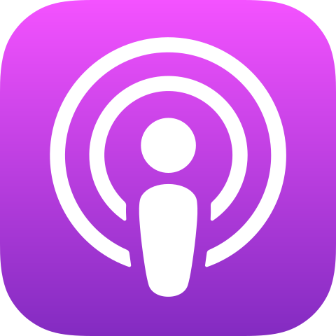

.. _usage:

Usage
*****

Structure
=========

The best way to understand the app is to simply browse the `online demo <https://djangoapplepodcastdemo.herokuapp.com/podcast/>`_ or locally after adding a show and a few episodes in the admin. But for reference, assuming you chose ``podcast`` as the base of your URL conf, the structure is:

=====================================  ============================  ===================================== =========== =============================== ========================== ===========================================
URL                                    URL name                      View                                  Model       Template                        Context                    Absolute URLs
=====================================  ============================  ===================================== =========== =============================== ========================== ===========================================
``/podcast/``                          ``podcast:show_detail``       ``podcast.views.ShowDetailView``      ``Show``    ``podcast/show_detail.html``    ``show``, ``episode_list`` ``{{ show.get_absolute_url }}``
``/podcast/feed/``                     ``podcast:show_feed``         ``podcast.views.ShowFeed``            ``Show``                                                               ``{{ show.get_absolute_feed_url }}``
``/podcast/<episode-slug>/``           ``podcast:episode_detail``    ``podcast.views.EpisodeDetailView``   ``Episode`` ``podcast/episode_detail.html`` ``episode``                ``{{ episode.get_absolute_url }}``
``/podcast/<episode-slug>/download/``  ``podcast:episode_download``  ``podcast.views.EpisodeDownloadView`` ``Episode``                                                            ``{{ episode.get_absolute_download_url }}``
=====================================  ============================  ===================================== =========== =============================== ========================== ===========================================

And if you chose ``podcasts`` and set ``PODCAST_SINGULAR = False`` to display multiple shows:

==================================================  ============================  ===================================== =========== =============================== ========================== ===========================================
URL                                                 URL name                      View                                  Model       Template                        Context                    Absolute URLs
==================================================  ============================  ===================================== =========== =============================== ========================== ===========================================
``/podcasts/``                                      ``podcast:show_list``         ``podcast.views.ShowListView``        ``Show``    ``podcast/show_list.html``      ``show_list``
``/podcasts/<show-slug>/``                          ``podcast:show_detail``       ``podcast.views.ShowDetailView``      ``Show``    ``podcast/show_detail.html``    ``show``, ``episode_list`` ``{{ show.get_absolute_url }}``
``/podcasts/<show-slug>/feed/``                     ``podcast:show_feed``         ``podcast.views.ShowFeed``            ``Show``                                                               ``{{ show.get_absolute_feed_url }}``
``/podcasts/<show-slug>/<episode-slug>/``           ``podcast:episode_detail``    ``podcast.views.EpisodeDetailView``   ``Episode`` ``podcast/episode_detail.html`` ``episode``                ``{{ episode.get_absolute_url }}``
``/podcasts/<show-slug>/<episode-slug>/download/``  ``podcast:episode_download``  ``podcast.views.EpisodeDownloadView`` ``Episode``                                                            ``{{ episode.get_absolute_download_url }}``
==================================================  ============================  ===================================== =========== =============================== ========================== ===========================================

Enclosures
==========

The show feed is a subclass of Django's |Rss201rev2Feed|_ feed generator class, which `prohibits the use of more than one enclosure <https://github.com/django/django/blob/2.0/django/utils/feedgenerator.py#L303>`_. Although Django's syndication documentation doesn't directly state it, the `use of multiple enclosures <https://docs.djangoproject.com/en/2.0/ref/contrib/syndication/#enclosures>`_ are meant for only subclasses of Django's |Atom1Feed|_ feed generator class.

.. |Rss201rev2Feed| replace:: ``Rss201rev2Feed``
.. _Rss201rev2Feed: https://docs.djangoproject.com/en/2.0/ref/contrib/syndication/#syndicationfeed-classes

.. |Atom1Feed| replace:: ``Atom1Feed``
.. _Atom1Feed: https://docs.djangoproject.com/en/2.0/ref/contrib/syndication/#syndicationfeed-classes

The `RSS Advisory Board <http://www.rssboard.org/rss-profile#element-channel-item-enclosure>`_ states:

   Support for the enclosure element in RSS software varies significantly because of disagreement over whether the specification permits more than one enclosure per item. Although the author intended to permit no more than one enclosure in each item, this limit is not explicit in the specification.

   For best support in the widest number of aggregators, an item *should not* contain more than one enclosure.

Therefore, enclosures are modeled as |OneToOneField|_ s off of episodes, limiting episodes to one and only one enclosure.

.. |OneToOneField| replace:: ``OneToOneField``
.. _OneToOneField: https://docs.djangoproject.com/en/2.0/ref/models/fields/#onetoonefield

Apple Podcasts does not host enclosure files; it is the responsibility of the developer to host them. Because an enclosure's file is a |FileField|_, files are uploaded to your |MEDIA_ROOT|_ setting. If you haven't already, your ``urls.py`` should include patterns for interfacing with files in local development.

.. |FileField| replace:: ``FileField``
.. _FileField: https://docs.djangoproject.com/en/2.0/ref/models/fields/#django.db.models.FileField

.. |MEDIA_ROOT| replace:: ``MEDIA_ROOT``
.. _MEDIA_ROOT: https://docs.djangoproject.com/en/2.0/ref/settings/#std:setting-MEDIA_ROOT

.. code-block:: python

   from django.conf import settings
   from django.conf.urls.static import static
   from django.contrib.staticfiles.urls import staticfiles_urlpatterns
   from django.urls import include, path

   urlpatterns = [
       # ...
       path('podcast/', include('podcast.urls')),
   ]

   # Static/media for local development
   if getattr(settings, 'DEBUG', False):
       urlpatterns += staticfiles_urlpatterns()
       urlpatterns += static(settings.MEDIA_URL, document_root=settings.MEDIA_ROOT)

Although file management in production is out of scope of this documentation, consider using Amazon Web Service's `S3 (Simple Storage Service) <https://console.aws.amazon.com/s3/home>`_ to host files and `Django Storages <https://pypi.python.org/pypi/django-storages>`_ and `Boto <https://pypi.python.org/pypi/boto>`_ (and, if using Python 3, `Boto 3 <https://pypi.python.org/pypi/boto3>`_), to interface with them.

The `code repository <https://github.com/richardcornish/django-applepodcast-demo>`_ of the `online demo <https://djangoapplepodcastdemo.herokuapp.com/podcast/>`_ is worth looking at for a complete implementation, especially the `settings file <https://github.com/richardcornish/django-applepodcast-demo/blob/master/demo/demo/settings.py>`_ if you expect to use AWS's S3.

Protocols
=========

Depending on the operating system and/or web browser, it's possible to immediately subscribe a user to a podcast in iTunes or the iOS Podcasts app by using ``itpc://`` or ``feed://`` `protcol-based URLs <https://www.engadget.com/2012/09/24/tip-making-itpc-links-work-with-the-official-odcasts-app/>`_ rather than the standard ``http://`` or ``https://``.

The app comes with the ```` template tag to help create these URLs.

.. code-block:: django

   
   ">

Result:

.. code-block:: html

   itpc://127.0.0.1:8000/podcast/feed/

Beware that these URLs are purely interaction based; you would not be required to submit the show feed to Apple Podcasts, but you would also not be able to track users' behavior in Podcasts Connect. For this reason, you're probably better off in a traditional submission to Apple Podcasts, saving your new URL in the ``Show`` model, and using the ``show.apple`` variable in your template.

.. code-block:: django

   {{ show.apple }}

Submission
==========

The show feed URL is:

.. code-block:: html

   /podcast/feed/

If you have multiple shows, each respective show feed URL is:

.. code-block:: html

   /podcasts/<show-slug>/feed/

Submit the show feed to `Podcasts Connect <https://podcastsconnect.apple.com/>`_.

Badges
======

After Apple Podcasts approves your podcast, feel free to use the "Listen on Apple Podcasts" badge or icon, the U.S. versions of which are included as minified static files. You can also download them from the `Apple Podcasts Identity Guidelines <https://www.apple.com/itunes/marketing-on-podcasts/identity-guidelines.html>`_. The SVGs were minified with `SVGO <https://www.npmjs.com/package/svgo>`_.

Badge
-----

.. image:: _static/img/badge.svg

.. code-block:: django

   
   

Icon
-----

.. code-block:: django

   
   

Load the white or black icons similarly.

.. code-block:: django

   
   

.. code-block:: django

   
   
